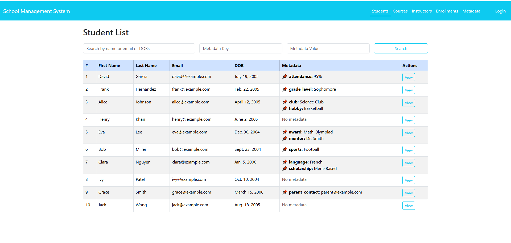

# Student Management System

A Django-based **Student Management System** developed as part of an **assessment task**.
This system manages **Students, Courses, Instructors, Enrollments, and Metadata**.
It includes  CRUD functionalities, basic auth, search with pagination and charts.


## Features
- Manage **Students, Courses, Instructors, and Enrollments**
- **Metadata support** for flexible extension of the model (key/value pairs)
- Search and pagination for list views
- Attractive **Bootstrap-based UI**
- Seed data for quick setup

---

## Tech Stack
- **Backend:** Django 5, Python 3
- **Frontend:** Django Templates with **Bootstrap 5** and **Chart.js**
- **Database:** SQLite (default, but configurable)
- **Authentication:** Django built-in authentication system
- **Other:** Custom Template Filters, Search with Pagination, Metadata system

---

## Installation

1. **Clone the repository**
   ```bash
   git clone https://github.com/PalRhitika/Student-Management-System.git
   cd student-management
   ```

2. **Create virtual environment**
   ```bash
   python -m venv env
   source env/bin/activate   # on Linux/Mac
   env/scripts/activate      # on Windows
   ```

3. **Install dependencies**
   ```bash
   pip install -r requirements.txt
   ```

4. **Apply migrations**
   ```bash
   py manage.py makemigrations
   python manage.py migrate
   ```

5. **Load seed data (dummy records)**
   ```bash
   python manage.py loaddata seed.json
   ```

6. **Create superuser**
   ```bash
   python manage.py createsuperuser
   ```

7. **Run the server**
   ```bash
   python manage.py runserver
   ```

8. Visit: `http://127.0.0.1:8000/`

**Note: This system allows guest users to view lists and details of Students, Courses, Instructors, and Enrollments. However, only the superuser can create, update, or delete records and manage Metadata. Please log in with your superuser credentials to perform administrative actions.**

---

##  Dummy Data
The project includes **seed.json** with:
- 10 Metadata records
- 10 Students
- 6 Courses
- 4 Instructors
- 15 Enrollments

Load anytime using:
```bash
python manage.py loaddata seed.json
```

## Some Glimpse of the System

### Login Page


### Students List Page


### Student Details Page


### Student Add Page


### Student Update Page


### Student Delete Modal


### Course List Page


