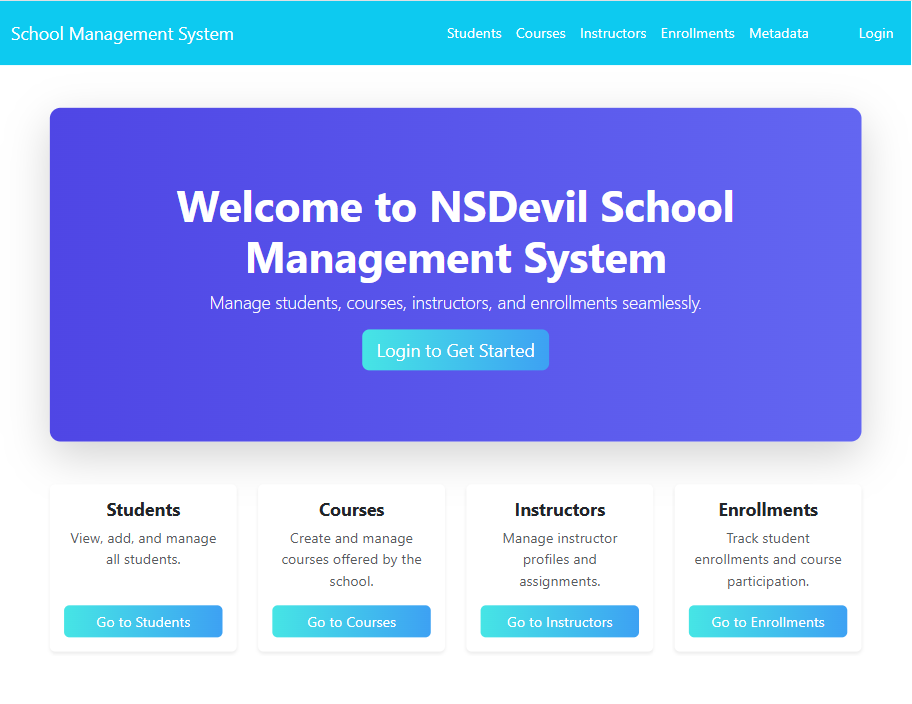

# Student Management System

A Django-based **Student Management System** developed as part of an **assessment task**.
This system manages **Students, Courses, Instructors, Enrollments, and Metadata**, following Django’s **Model–View–Template (MVT) architecture**.
It includes CRUD functionalities, basic authentication, search with pagination, and chart visualizations.


## Features
- Manage **Students, Courses, Instructors, and Enrollments**
- **Metadata support** for flexible extension of the model (key/value pairs)
- Search and pagination for list views
- Attractive **Bootstrap-based UI**
- Seed data for quick setup

---

## Tech Stack
- **Backend:** Django 5, Python 3
- **Frontend:** Django Templates with **Bootstrap 5** and **Chart.js**
- **Database:** SQLite (default, but configurable)
- **Authentication:** Django built-in authentication system
- **Other:** Custom Template Filters, Search with Pagination, Metadata system

---

## Installation

1. **Clone the repository**
   ```bash
   git clone https://github.com/PalRhitika/Student-Management-System.git
   cd Student-Management-System
   ```

2. **Create virtual environment**
   ```bash
   python -m venv env
   source env/bin/activate   # on Linux/Mac
   env/scripts/activate      # on Windows
   ```

3. **Install dependencies**
   ```bash
   pip install -r requirements.txt
   ```

4. **Apply migrations**
   ```bash
   py manage.py makemigrations
   python manage.py migrate
   ```

5. **Load seed data (dummy records)**
   ```bash
   python manage.py loaddata seed.json
   ```

6. **Create superuser**
   ```bash
   python manage.py createsuperuser
   ```

7. **Run the server**
   ```bash
   python manage.py runserver
   ```

8. Visit: `http://127.0.0.1:8000/`

**Note: This system allows guest users to view lists and details of Students, Courses, Instructors, and Enrollments. However, only the superuser can create, update, or delete records and manage Metadata. Please log in with your superuser credentials to perform administrative actions.**

---

##  Dummy Data
The project includes **seed.json** with:
- 10 Metadata records
- 10 Students
- 6 Courses
- 4 Instructors
- 15 Enrollments

Load anytime using:
```bash
python manage.py loaddata seed.json
```

## Some Glimpse of the System

### Home Page



### Login Page


### Students List Page


### Student Details Page


### Student Add Page


### Student Update Page


### Student Delete Modal


### Course List Page


##  User Experience

- **Guest Users:** Can view lists and details of Students, Courses, Instructors, and Enrollments without logging in.
- **Superuser:** Can create, update, delete, and manage all entities including Metadata.
- **Navigation:** Use the top menu or homepage cards to access Students, Courses, Instructors, and Enrollments.
- **Search & Pagination:** Quickly filter and browse records in list views.
- **Charts:** Visualize academic performance through charts in the Student detail pages.

## 💡 Learning Experience / Reflection

Working on this assessment was a highly valuable experience. I got to deepen my understanding of **Django’s MVT architecture, class-based views, template inheritance, and custom template filters**. Implementing CRUD operations, search, pagination, and chart visualizations allowed me to combine backend logic with frontend presentation effectively.

A big thank you to **NSDevil** for providing this assessment. I got a chance to  explore topics and areas I was previously unfamiliar with from which I learned a lot while building a practical, user-friendly Student Management System.
